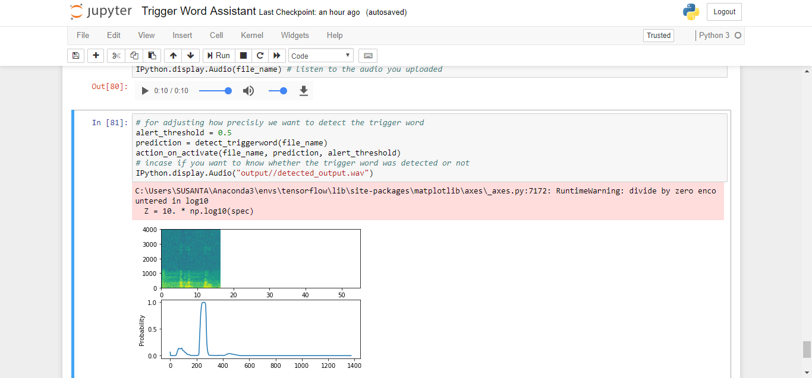
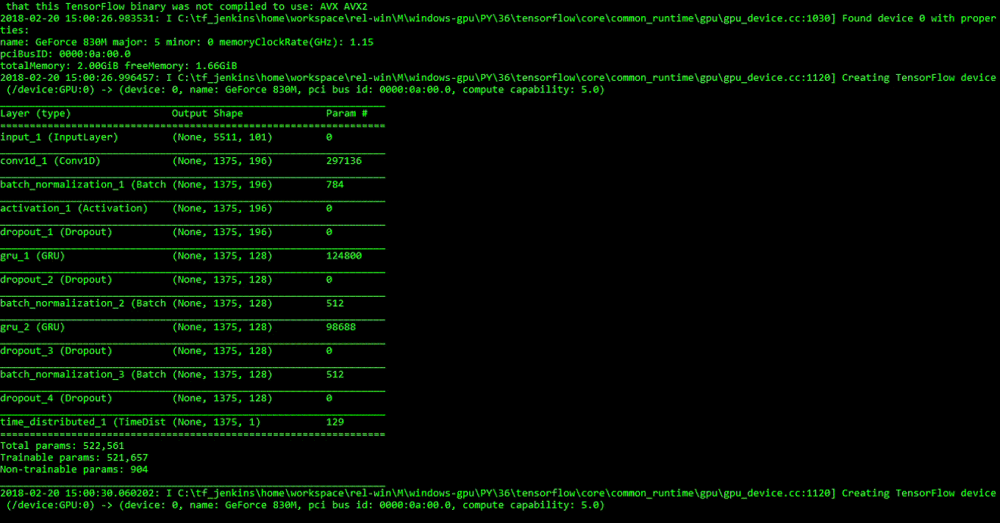

# TriggerWordAssistant
An assistant app which which executes command on detecting the **trigger word**. Here the trigger word used is **"activate"**. After detecting the trigger word it does the action specified in the code, like I coded it to open Chrome everytime it detects **activate**.

The Model used for detecting trigger word uses **Gated Recurrent Units (GRU)**.
The model is build using Keras.

There are 2 versions for this application: 
1. Jupyter notebook explaining everthing. 
  

2. Python file incase you want to directly see what is happening. 

